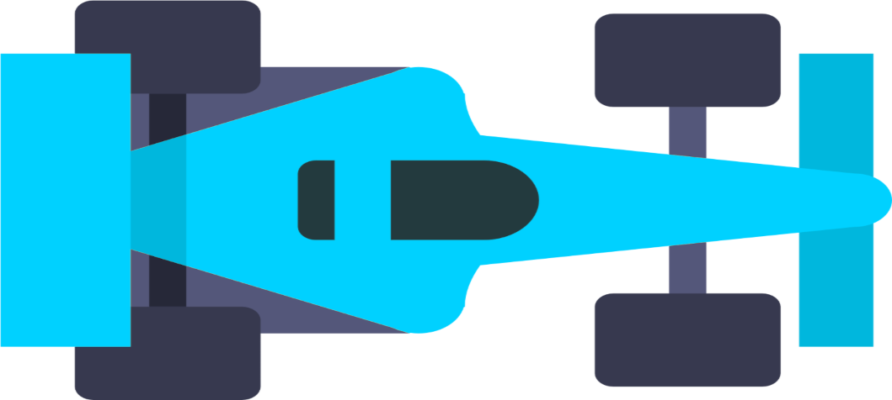
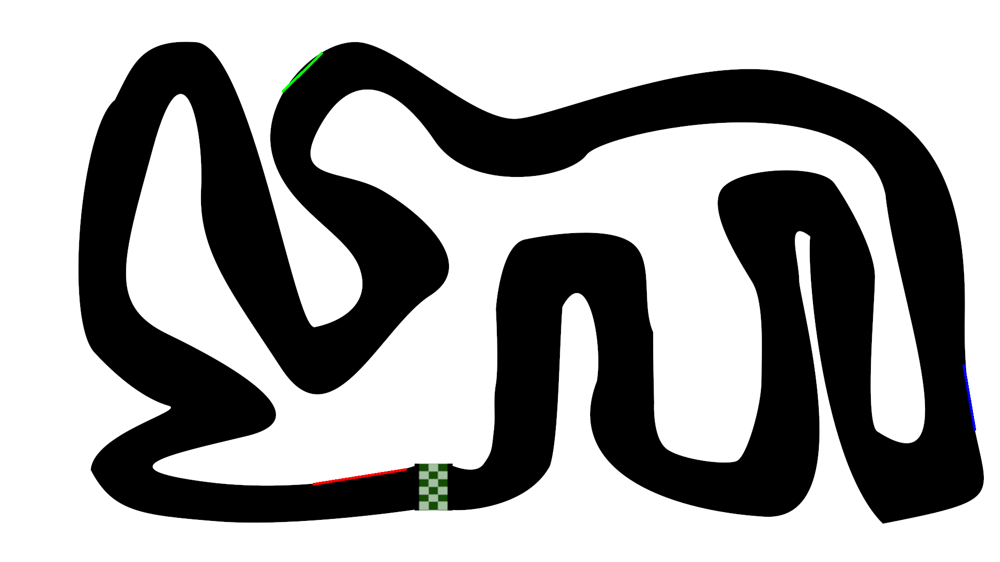

# AI Car 2D Simulation

This project is a Proof of Concept for a 2D car simulation with AI. The goal is to create a simulation where the AI learns to drive a car on a track.
The circuits and game mechanisms have been created by NeuralNine :

- GitHub: https://github.com/NeuralNine/ai-car-simulation
- Youtube: https://www.youtube.com/watch?v=Cy155O5R1Oo

## Introduction
The project is divided in two parts: the simulation and the AI. The simulation is a 2D game where the player can drive a car on a track. The AI is a neural network that learns to drive the car on the track.

## Getting started
### Prerequisites
- Python >3.10

We highly recommand you to use a virtual environment to run the project.
For this project we used the virtual env feature of PyCharm.

### Installation
- Clone the repository
- Install the dependencies with `pip install -r requirements.txt`

## Usage
### Simulation
To run the simulation, run the `Main.py` file.

### Parameters
You can change the parameters of the simulation in the main function of the `Main.py` file.

- NB_CARS: Number of cars in the simulation<br>
This constant must be equal or lower than your number of CPU cores. If you have 4 cores, you can set this constant to 4.

- ID_MAP: Id of the map to load<br>
This constant must be between 1 and 5. There are 5 maps in the game.
Feel free to create your own maps and add them to the `assets` folder.

- ALGO: The algorithm to use for the training.<br>
The available algorithms are `A2C` and `PPO`.

```py
if __name__ == '__main__':

    NB_CARS = 8
    ID_MAP = 4
    ALGO = "A2C"

    # Start Race Server
    race = threading.Thread(target=thread_race, args=(NB_CARS, ID_MAP))
    race.start()

    if NB_CARS == 1:
        # Start Training with Mono Client
        train_monoproccess(ALGO, ID_MAP)
    else:
        # Start Training with AI Clients
        train_multiproccess(ALGO, ID_MAP, NB_CARS)
```

### AI
For more information about how it works and how to use it, please refer to the [documentation of stable-baselines](https://stable-baselines3.readthedocs.io/en/master/index.html) and the [video of NeuralNine](https://www.youtube.com/watch?v=Cy155O5R1Oo)

### Car

The car is a 2D sprite that can move on the map. It has a speed and a direction. The car can move forward and backward. It can also turn left and right.



### Maps

Here are the maps available in the game:

#### Map 1


#### Map 2


#### Map 3



#### Map 4


#### Map 5


We do not use this map in our tests because it is too difficult for the AI and does seems relevant for our tests.


## About us
This project has been created by a group of students from the ESEO Engineering School in Angers, France. We are 3 students in the 5th year of the school, in the Software Engineering and Artificial Intelligence specialization.